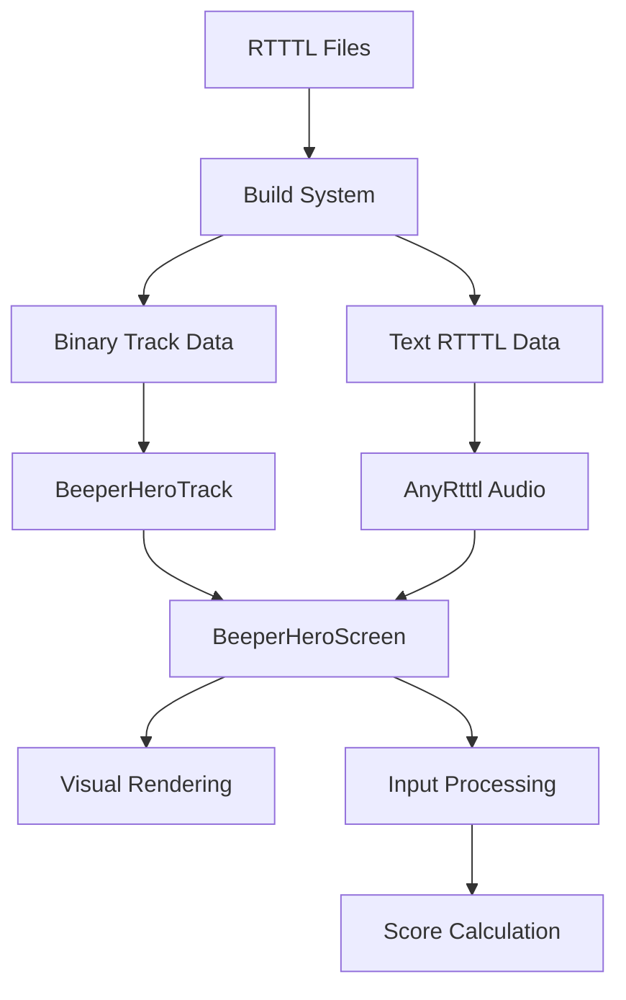

# BeeperHero Rhythm Game Documentation

## Overview

BeeperHero is a Guitar Hero-style rhythm game integrated into the AlertTX-1 project. Players press buttons in time with falling notes across 3 lanes, synchronized with RTTTL ringtone music. The game features real-time audio playback, visual note rendering, scoring systems, and song selection from the device's ringtone library.

## Game Architecture

### Core Components

#### 1. BeeperHeroScreen (UI Layer)
**File**: `src/ui/games/BeeperHeroScreen.h/.cpp`

The main game screen that handles:
- Game state management (song selection, countdown, playing, game over)
- User input processing via the UI framework's InputRouter
- Visual rendering (lanes, notes, score, UI elements)
- Audio synchronization with AnyRtttl library
- Score tracking and combo system

**Game States**:
- `SONG_SELECT`: Choose from available ringtones
- `COUNTDOWN`: Pre-game countdown (future enhancement)
- `PLAYING`: Active gameplay with falling notes
- `GAME_OVER`: Results screen with statistics
- `PAUSED`: Pause state (future enhancement)

#### 2. BeeperHeroTrack (Data Layer)
**File**: `src/games/beeperhero/BeeperHeroTrack.h/.cpp`

Handles pre-generated binary track data:
- Loads optimized binary track files from memory
- Provides gameplay timing functions
- Manages note visibility and hit detection
- Calculates note positions for smooth animation

**Data Format**: Custom binary format ("BPHR") with:
- Header with metadata (song name, BPM, duration, note count)
- Compressed note data (start time, duration, lane, flags)
- Memory-efficient packed structures

#### 3. BeeperHeroParser (Processing Layer)  
**File**: `src/games/beeperhero/BeeperHeroParser.h/.cpp`

Real-time RTTTL parsing for development/testing:
- Converts RTTTL strings to game notes
- Maps notes to lanes based on octave/frequency
- Calculates precise timing information
- Supports dynamic note generation

### Data Flow



## Gameplay Mechanics

### Lane System

The game features **3 lanes** mapped to the device's 3 buttons:

| Lane | Button | Note Range | Color | Description |
|------|--------|------------|-------|-------------|
| 0 | A (Left) | Octave ≤4 | Green | Low notes |
| 1 | B (Middle) | Octave 5 | Yellow | Mid notes |
| 2 | C (Right) | Octave ≥6 | Magenta | High notes |

### Note Mapping Algorithm

Notes are automatically mapped from RTTTL data to lanes:

```cpp
// Lane assignment based on octave
if (octave <= 4) return 0;      // Low lane
else if (octave == 5) return 1; // Mid lane  
else return 2;                  // High lane
```

**Rest notes (p)** are filtered out and don't appear in gameplay.

### Timing System

#### Visual Timing
- **Approach Time**: 2000ms (notes appear 2 seconds early)
- **Hit Window**: ±150ms for successful hits
- **Hit Line**: Y=180 pixels where notes should be pressed
- **Note Speed**: Calculated for smooth 30 FPS animation

#### Hit Detection
```cpp
bool isHittable = timeDiff <= HIT_WINDOW; // ±150ms
float accuracy = 1.0f - (timeDiff / HIT_WINDOW);
```

### Scoring System

#### Base Scoring
- **Hit**: 100 points + combo bonus
- **Miss**: 0 points, combo reset
- **Combo Multiplier**: +10 points per combo level

#### Statistics Tracked
- Total score
- Notes hit vs total notes
- Accuracy percentage  
- Maximum combo achieved
- Song completion time

## Technical Implementation

### Audio Integration

The game uses **dual audio systems**:

1. **Text RTTTL → AnyRtttl** (Audio playback)
   ```cpp
   anyrtttl::nonblocking::begin(BUZZER_PIN, textRTTTL);
   anyrtttl::nonblocking::play(); // Called in update loop
   ```

2. **Binary Track Data → BeeperHeroTrack** (Gameplay timing)
   ```cpp
   track.loadFromMemory(trackData, trackSize);
   bool hittable = track.isNoteHittable(noteIndex, currentTime, HIT_WINDOW);
   ```

### Memory Optimization

#### Track Data Format
Binary format provides **significant memory savings**:

```cpp
struct BeeperHeroTrackHeader {
    char magic[4];           // "BPHR" 
    uint8_t version;         // Format version
    uint8_t songNameLength;  // Song name length
    uint16_t noteCount;      // Total notes
    uint32_t songDuration;   // Duration in ms
    uint16_t bpm;           // Beats per minute
} __attribute__((packed));

struct BeeperHeroNote {
    uint32_t startTime;     // Start time (ms)
    uint16_t duration;      // Duration (ms)  
    uint8_t lane;          // Lane (0-2)
    uint8_t flags;         // Special properties
} __attribute__((packed));
```

#### Memory Usage Comparison
- **Text RTTTL**: ~100-200 bytes per song
- **Binary Track**: ~20-50 bytes per song (70-80% reduction)
- **Note Data**: 10 bytes per note (highly compressed)

### Build System Integration

#### Automatic Track Generation

The `tools/generate_ringtone_data.py` script automatically:

1. **Scans** `data/ringtones/*.rtttl.txt` files
2. **Parses** RTTTL into game notes with lane mapping
3. **Generates** binary track data in BeeperHero format
4. **Creates** accessor functions in `ringtone_data.h`:
   ```cpp
   const uint8_t* getBeeperHeroTrackData(int index);
   const uint8_t* getBeeperHeroTrackData(const char* name);
   size_t getBeeperHeroTrackSize(int index);
   size_t getBeeperHeroTrackSize(const char* name);
   ```

#### Caching System
- **SHA-256 hashing** detects file changes
- **Incremental regeneration** only when needed  
- **Fast builds** when no changes detected

## User Interface

### Song Selection Screen

**Controls**:
- **Button A**: Previous song
- **Button B**: Next song  
- **Button C**: Start game
- **Long press any**: Back to main menu

**Display**:
- Current song name and index (e.g., "5/16: Mario")
- Control instructions
- BeeperHero title

### Gameplay Screen

**Visual Elements**:
- **3 vertical lanes** with colored dividers
- **Falling notes** (8x8 pixel squares) in lane colors
- **Hit line** at bottom where notes should be pressed
- **Score display** with current score and combo
- **Progress bar** showing song completion

**Real-time Display**:
- Score and combo counter
- Song progress percentage
- Smooth note animation at 30 FPS

### Game Over Screen

**Statistics Display**:
- Final score
- Notes hit vs total notes
- Accuracy percentage
- Maximum combo achieved

**Controls**:
- **Button A**: Play again (same song)
- **Button B/C**: Return to song selection
- **Long press any**: Back to main menu

## Configuration

### Gameplay Constants

```cpp
// Timing settings
static const unsigned long NOTE_APPROACH_TIME = 2000;  // ms
static const unsigned long HIT_WINDOW = 150;           // ms  

// Visual settings
static const int LANE_WIDTH = 53;     // pixels (160/3)
static const int LANE_HEIGHT = 120;   // pixels
static const int HIT_LINE_Y = 180;    // pixels
static const int NOTE_SIZE = 8;       // pixels

// Scoring settings  
static const int BASE_SCORE = 100;    // points per hit
static const int COMBO_BONUS = 10;    // points per combo level
```

### Hardware Requirements

**Minimum Requirements**:
- **ESP32/ESP32-S3** microcontroller
- **ST7789 240x240 display** for smooth graphics
- **3 input buttons** for lane control
- **Buzzer/speaker** on designated pin
- **4MB+ flash** for ringtone storage

**Recommended**:
- ESP32-S3 for better performance
- External speaker for audio quality
- Tactile buttons for responsive gameplay

## Performance Characteristics

### Rendering Performance
- **30 FPS** smooth animation
- **Minimal redraw** optimization for battery life
- **Efficient note positioning** calculations

### Memory Usage
- **Binary track data**: ~50 bytes per song
- **Runtime memory**: <2KB for active game state
- **Flash storage**: Scales with ringtone library size

### Battery Impact
- **Non-blocking audio**: Maintains power management
- **Optimized rendering**: Reduces CPU usage
- **Smart caching**: Minimizes flash access

## Development Guide

### Adding New Songs

1. **Add RTTTL file** to `data/ringtones/`:
   ```bash
   echo "NewSong:d=4,o=5,b=120:c,c,g,g,a,a,g" > data/ringtones/new_song.rtttl.txt
   ```

2. **Regenerate data**:
   ```bash
   make ringtones  # Automatic with caching
   ```

3. **Song available** in BeeperHero automatically

### Custom Difficulty Levels

Future enhancement support for:
```cpp
enum TrackDifficulty {
    DIFFICULTY_EASY = 0,    // Fewer notes, larger hit window
    DIFFICULTY_MEDIUM = 1,  // Standard gameplay
    DIFFICULTY_HARD = 2     // More notes, tighter timing
};
```

### Note Type Extensions

Future support for special notes:
```cpp
#define NOTE_FLAG_HOLD     0x01    // Long notes (hold button)
#define NOTE_FLAG_BONUS    0x02    // Bonus notes (extra points)  
#define NOTE_FLAG_CRITICAL 0x04    // Critical notes (must hit)
```

## Troubleshooting

### Common Issues

#### No Audio During Gameplay
**Symptoms**: Visual notes appear but no sound
**Causes**: 
- Missing text RTTTL data
- Incorrect buzzer pin configuration
- AnyRtttl library not updating

**Solutions**:
```cpp
// Check BUZZER_PIN in settings.h
#define BUZZER_PIN 25

// Verify audio data exists  
const char* textRTTTL = getTextRTTTL(selectedSongIndex);
if (!textRTTTL) {
    Serial.println("No audio data available");
}

// Ensure update() called in main loop
anyrtttl::nonblocking::play();
```

#### Notes Not Synchronized
**Symptoms**: Visual notes don't match audio timing
**Causes**:
- Different RTTTL data for audio vs visuals
- Timing calculation errors
- Performance issues affecting frame rate

**Solutions**:
```cpp
// Check track data validity
if (!track.isValid()) {
    Serial.println("Invalid track data");
}

// Monitor timing accuracy
unsigned long timeDiff = abs(currentTime - note->startTime);
Serial.printf("Timing diff: %lu ms\n", timeDiff);
```

#### Poor Performance
**Symptoms**: Choppy animation, delayed input response
**Causes**:
- Too frequent screen redraws
- Inefficient note calculations
- Memory fragmentation

**Solutions**:
- Optimize redraw frequency
- Use binary track data (not parser)
- Monitor heap usage:
```cpp
Serial.printf("Free heap: %d bytes\n", ESP.getFreeHeap());
```

### Debug Commands

```cpp
// Enable detailed logging
#define BEEPER_HERO_DEBUG 1

// Track performance
track.printTrackInfo();        // Track statistics
Serial.printf("FPS: %.1f\n", 1000.0f / frameTime);

// Monitor memory
Serial.printf("Heap: %d\n", ESP.getFreeHeap());
```

## Future Enhancements

### Planned Features

1. **Difficulty Levels**
   - Easy: Fewer notes, larger hit windows
   - Hard: More complex patterns, tighter timing

2. **Advanced Scoring**
   - Perfect/Good/Miss ratings
   - Streak multipliers  
   - Global high scores

3. **Visual Enhancements**
   - Note trails and effects
   - Background visualizations
   - Improved hit feedback

4. **Gameplay Modes**
   - Practice mode with slow playback
   - Challenge mode with special songs
   - Custom song support

### Technical Improvements

1. **Performance Optimization**
   - Hardware-accelerated graphics
   - More efficient note rendering
   - Reduced memory usage

2. **Audio Enhancements**  
   - Volume control integration
   - Audio effects (reverb, EQ)
   - Multiple audio formats

3. **Data Format Evolution**
   - Version 2 track format
   - Compression improvements
   - Extended metadata

## Integration with AlertTX-1

### UI Framework Compatibility

BeeperHero integrates seamlessly with the AlertTX-1 UI framework:

- **Screen Management**: Inherits from base `Screen` class
- **Input Routing**: Uses framework `InputRouter` for button handling  
- **Navigation**: Supports standard back navigation (long press)
- **Theme Support**: Respects system theme and color scheme

### Resource Sharing

- **Ringtone Library**: Shares same RTTTL files as alert ringtones
- **Audio System**: Uses same buzzer for game and notifications
- **Display**: Efficiently shares 240x240 ST7789 display
- **Memory**: Optimized to coexist with alert functionality

### Power Management

- **Battery Friendly**: Non-blocking design preserves power management
- **Sleep Integration**: Game can be interrupted by system sleep
- **Resource Cleanup**: Proper cleanup when exiting to other screens

This documentation provides a comprehensive overview of the BeeperHero rhythm game system within the AlertTX-1 project. The game demonstrates the device's versatility beyond simple alert functionality while maintaining the embedded system's resource constraints and power efficiency requirements.
